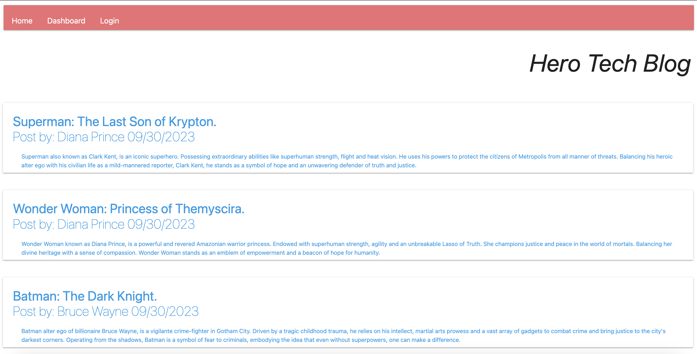

# BC14-Tech-Blog

## 🌏 Table of Contents:
- [Description](#description)
- [Installation](#installation)
- [Usage](#usage)
- [Application UI](#application-user-interface)
- [Credits & Resources](#credits-and-resources)
- [Coded With](#coded-with)
- [Contributing](#contributing)
- [License](#license)

## Description:
* A CMS-style blog site where anyone can publish their own blog posts and comment on other peoples posts. Built site completely from scratch & deployed to Heroku. This simple app followed the MVC paradigm in its architectural structure using Handlebars.js as the templating language, Sequelize as the ORM and the express-session npm package for authentication.

### User Story

```md
AS A developer who writes about tech
I WANT a CMS-style blog site
SO THAT I can publish articles, blog posts, and my thoughts and opinions
```

## Installation:
* `Git Clone Repository`
* `Create .env for login`
* `npm i`
* `mysql -u root -p`
* `source schema copy path`
* `quit`
* `npm run seed`
* `npm start`
* `localhost:3001`

## Usage:
* [Deployed Heroku: Tech Blog](https://oreh-hcet-golb-e2c2399141b9.herokuapp.com/)

## Application User Interface:


## Credits and Resources:
* Google search & Youtube videos.
* ChatGpt for troubleshooting.
* Stack Overflow & MDN.
* Project 2: Fit Squad.
* Mini Project 14 EdX.

## Coded With:
* Materialize.
* Handlebars.
* Sequelize.
* MySQL2.
* Express.
* Inquirer.
* Node.js.
* VS Code.

## Contributing:
* Any ideas or feedback is very much appreciated.

## License:
[](https://opensource.org/licenses/MIT)